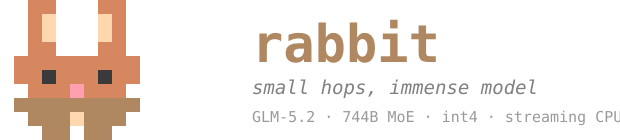

<p align="center">
  
</p>

**Small hops, immense models.** A Rust engine that runs frontier open-weight MoE models on a
single machine. The dense part stays resident in RAM; the routed experts stream from disk on
demand.

Moonshot AI published **Kimi K3** on 2026-07-27, a 2.8-trillion-parameter Mixture-of-Experts
model and one of the largest open-weight releases so far. rabbit runs it the next day, straight
off Moonshot's published checkpoint. No conversion step.

```
$ rabbit --model /mnt/data/kimi-k3 --prompt "What is the capital of France?" --max-tokens 40
loading model (dbits=4, ebits=4)...
model loaded in 610.0s (93 layers, 896 experts/layer)
prefill (7 tokens)...
  prefill done in 412.8s
  ...
...response["answer"] == "Paris"...

40 tokens in 2698.1s
```

Correctness validated three ways before that run. Bit-exact against a random-weight instance of
Moonshot's own PyTorch reference (teacher-forcing, every position, `tests/teacher_forcing_k3.rs`).
A structural smoke test against the real 1.56TB checkpoint (`examples/k3_smoke.rs`). And the real
prompt above, answered correctly. No performance work has landed for K3 yet; the numbers above
are correctness-first, not tuned. rabbit's other architecture, GLM-5.2, started from a similarly
slow floor and is now 3.5× faster across eight measured versions. See
[Honest numbers](#honest-numbers-ryzen-ai-9-hx-370-12-cores24-threads) and `PERFORMANCE.md`.

K3 brings Kimi Delta Attention plus a Gated MLA hybrid, Stable LatentMoE (routed experts compute
in a narrower latent width, not the full hidden size), Attention Residuals (a transient
block-pooling mechanism across layers), and native OCP MXFP4 quantization for its 896
experts/layer. rabbit reads that MXFP4 straight off disk, byte for byte, no requantization.

## The idea

A large MoE model activates a small fraction of its parameters per token, and only the routed
experts change token to token. So, across every architecture rabbit runs:

- the **dense part** (attention, shared experts, embeddings) stays **resident in RAM**, quantized;
- the **routed experts**, thousands of them, tens of MB each, live **on disk** and are
  **streamed on demand**, through a per-layer LRU cache, a persistent learned pin for the
  hottest ones, and the OS page cache as a free extra tier.

## Architectures

| | Kimi K3 | Kimi Linear 48B | GLM-5.2 |
|---|---|---|---|
| total / active params | 2.8T / not yet characterized | 48B / ~3B | 744B / ~40B |
| attention | KDA + Gated MLA, extra output gates | Kimi Delta Attention + Gated MLA | MLA + DSA sparse indexer |
| MoE routing | Stable LatentMoE (narrower latent width), shared experts | grouped routing, shared experts | `noaux_tc` sigmoid, shared expert |
| native quantization read | OCP MXFP4 (routed experts) | BF16 | FP8 (E4M3, block-scale) |
| checkpoint | Moonshot's real release | Moonshot's real release | pre-converted by colibrì's tooling |
| status | correctness-validated, perf work pending | tuned (`--session`, real chat) | fully tuned, 8 versions of perf work |

One `Model`/`KvState`/`ExpertCaches` family-dispatch enum in `src/model.rs` routes to the right
architecture from `config.json`'s `model_type`. `--chat`/`--serve`/`--prompt`/`--session` all
work the same way across the three.

## What's implemented

- **Faithful forward pass for all three architectures.** Validated token-exact against a
  synthetic oracle built from each model family's own real reference code, plus real-checkpoint
  validation for each.
- **MLA attention** with **weight absorption** for decode (no per-token k/v reconstruction) and
  dense reconstruction for prefill, parallelized with `rayon` across attention heads.
- **DSA sparse attention** (GLM-5.2's lightning indexer) and **Kimi Delta Attention** (KDA's
  chunked recurrence, short convolutions, per-channel decay gate). Real math, not approximated.
- **int4/int8/int2 quantization**, native **FP8** (E4M3, block-scale) and **OCP MXFP4** checkpoint
  loading, grouped-scale int4, and a **`.qs`** pre-quantized fast path.
- **AVX2 + AVX-512/VNNI kernels**, runtime-selected, plus `rayon` parallelization across CPU
  cores for every matmul and the absorbed-attention decode path.
- **`io_uring`-batched expert streaming**, with a sequential-`pread` fallback. K3's MXFP4 experts
  use the fallback today; batching that path is open work (see `ROADMAP.md`).
- **Persistent expert usage cache** (`.rabbit_usage`). Learns which experts your usage routes to
  and pins them, lazily, once a candidate is actually loaded through normal use.
- **KV-cache persistence** (`--session`). Conversations reopen warm across restarts.
- **A standalone checkpoint converter** (`bin/convert.rs`). Architecture-agnostic tensor
  classification, per-bucket bit-depth control, a `--report` quality pass. No dependency on
  colibrì's own tooling except for the pre-converted GLM-5.2 checkpoint above.
- **OpenAI-compatible HTTP server** (`--serve`). Streaming and non-streaming
  `/v1/chat/completions`, `/v1/models`, plus `/profile`, a rolling per-turn phase-timing window.
- **Multi-turn chat** (`--chat`) with each model's own real chat template.

Not yet built: live expert re-pinning, GPU/CUDA, MTP speculative decoding, ARM NEON,
grammar-constrained decoding, and a web UI (`/profile` is a JSON endpoint, no page serves it yet;
see `DASHBOARD_BRIEF.md`).

## Honest numbers (Ryzen AI 9 HX 370, 12 cores/24 threads, 123GB RAM, NVMe SSD)

| Model | RAM (GB) | Decode |
|---|---|---|
| Kimi K3 (2.78T MXFP4 MoE, `--expert-cache` auto=7) | 46 | 0.169 tok/s |
| GLM-5.2 (744B FP8 MoE, `--expert-cache 64`) | — | 1.02 words/s |
| Kimi Linear 48B | — | — |

Full logs: `PERFORMANCE_KIMI_K3.md`, `PERFORMANCE.md`.

### GLM-5.2

| metric | value |
|---|---|
| checkpoint | 378 GB (`jlnsrk/GLM-5.2-colibri-int4`) |
| `rayon` matmul parallelization | 128.9s → 36.3s for 5 tokens (3.5×), bit-exact output |
| `rayon` absorbed-attention parallelization | 224.3s → 158.4s for 70 decode tokens (~29% faster) |
| decode I/O share, steady state (warm cache) | 30-35% disk I/O, 65-70% compute |
| prefill I/O share (cold cache) | ~75% disk I/O |
| expert-cache hit rate, steady-state decode | 70-77% (miss floor 23-30%) |
| usage-cache auto-pin | 150 experts (2/layer × 75 MoE layers): prefill hits 0 → 136 |
| decode speed, current (v0.22.0) | 1.02 words/sec, up from 0.29 across eight measured versions |

All measured against the real checkpoints, not estimated. See `PERFORMANCE.md` for the full
chronological log, including techniques that were tried and reverted.

## Building

```bash
cargo build --release
cargo test
```

```bash
./target/release/rabbit --model /mnt/data/kimi-k3 --prompt "What is the capital of France?"
./target/release/rabbit --model /mnt/data/kimi-k3 --chat --session ~/.rabbit_session
./target/release/rabbit --model /mnt/data/kimi-k3 --serve --port 8000
```

`--model` auto-detects the architecture from the checkpoint's `config.json`. Kimi K3 and Kimi
Linear read Moonshot's own published `safetensors` shards directly: download
[`moonshotai/Kimi-K3`](https://huggingface.co/moonshotai/Kimi-K3) and point `--model` at it, no
conversion step. GLM-5.2 needs a directory in colibrì's converted layout; a pre-converted
checkpoint such as [`jlnsrk/GLM-5.2-colibri-int4`](https://huggingface.co/jlnsrk/GLM-5.2-colibri-int4)
works directly. See `--help` for the full flag list (`--max-tokens`, `--temperature`,
`--nucleus`, `--expert-cache`, `--dbits`, `--ebits`, `--shard-dirs`, `--no-usage-cache`, ...).

## Repo layout

```
src/
├── kimi_k3/                                  Kimi K3: SituAndMul, LatentMoE, Attention Residuals, MXFP4
├── kimi_linear/                              Kimi Linear 48B: KDA, short convs, tokenizer, chat template
├── glm52/                                    GLM-5.2: MLA+DSA attention, MoE router, checkpoint converter
├── model.rs                                  family-dispatch enum: Model/KvState/ExpertCaches/Tokenizer
├── safetensors.rs, quant.rs, kernels.rs      shard index, quantization, scalar/AVX2/AVX-512/MXFP4 kernels
├── expert_cache.rs, usage_cache.rs           LRU expert streaming + persistent usage learning
├── generate.rs, kv_session.rs                shared generation loop + KV-cache persistence
├── chat.rs, server.rs, main.rs               chat templates, HTTP server, CLI entrypoint
tests/oracle/     per-architecture oracle generators (real reference code, vendored) + fixtures
tools/            real-tokenizer validation fixtures (dev-only, not a runtime dependency)
benches/          criterion benchmarks (kernels, expert loading)
```

## Why Rust, why colibrì

colibrì is C, hand-written, effectively zero-dependency, and GLM-5.2-only. rabbit ports the same
algorithms to Rust with a short list of well-justified dependencies instead of a zero-dep stance,
adds its own performance work (the `rayon` parallelization above, KV-session and expert-usage
persistence), and generalizes the whole engine into a family-dispatch design that now runs two
more architectures colibrì doesn't. Every architecture is validated the same way colibrì
validates itself: token-exact teacher-forcing against a tiny synthetic model built from that
architecture's own real reference code.

Part of the [ferrumox](https://github.com/ferrumox) AI lab, alongside [fox](https://github.com/ferrumox/fox) (a production local-LLM server
wrapping llama.cpp). rabbit is the opposite kind of project: a research engine for models that
don't fit in memory even offloaded, built by hand instead of wrapping an existing runtime.

The name is a nod to [RabbitLLM](https://github.com/ManuelSLemos/RabbitLLM), an earlier,
unrelated project of mine (a fork of AirLLM that streams full model layers through limited GPU
VRAM). Same interest in running large models on constrained hardware, different problem, a
completely different technique. Nothing in this codebase is derived from that one.

## Versioning

Pre-1.0, `0.MINOR.PATCH`, tracked via git tags and `release/vX.Y.Z` branches rather than
`Cargo.toml`'s version field. `MINOR` bumps at the end of each development phase, `PATCH` for
fixes/polish within one. `rabbit-plan.md` has the full phase-by-phase history through GLM-5.2 and
Kimi Linear's bring-up.

## License

TBD.
